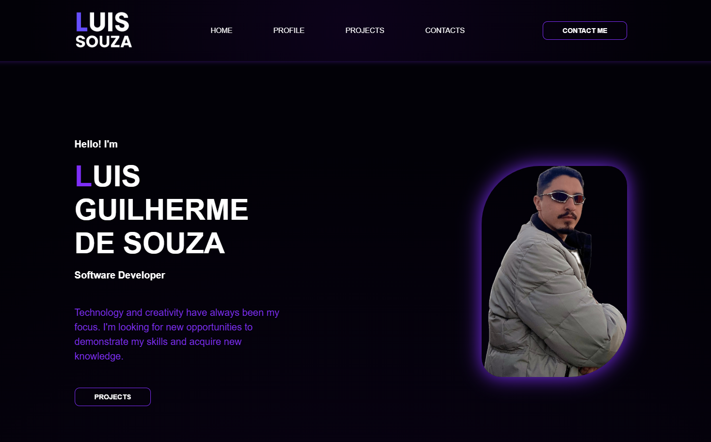

<h1 align='center'>
    PORTIFOLIO
</h1>

## 📕 About

**PORTFOLIO** in website mode, which presents all my knowledge and experience in the field of programming, a resume in the form of a website.

## 📌 Programming Languages ##

- JavaScript
- CSS
- HTML

## 🖥️ Preview ##

  

## 🌐 Link ##

- [PORTIFOLIO](https://devluisportifolio.netlify.app/)

